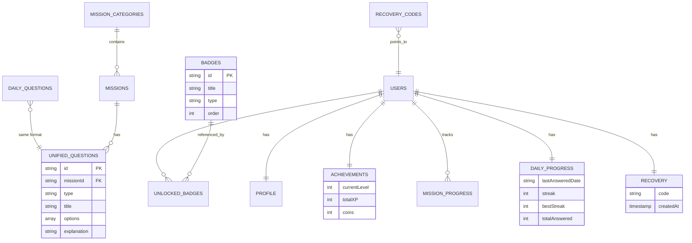

# 📚 PiensaPlay - Modelos de Datos Firebase

Documentación técnica para construir la interfaz de administración.

---

## 📊 Resumen de Colecciones

| Colección | Descripción | Tipo |
|-----------|-------------|------|
| `badges` | Catálogo de insignias | Global |
| `mission_categories` | Categorías de misiones | Global |
| `missions` | Misiones individuales | Global |
| `unified_questions` | Preguntas de misiones | Global |
| `daily_questions` | Pool de preguntas diarias (30+) | Global |
| `glossary` | Términos del glosario | Global |
| `learn_content` | Videos y podcasts | Global |
| `recovery_codes` | Índice de códigos de estudiante | Global |
| `notifications` | Configuración de notificaciones | Global |
| `shop_items` | Items de la tienda | Global |
| `users/{userId}/achievements` | Logros y nivel del usuario | Por Usuario |
| `users/{userId}/unlockedBadges` | Insignias desbloqueadas | Por Usuario |
| `users/{userId}/daily_progress` | Progreso en preguntas diarias | Por Usuario |
| `users/{userId}/mission_progress` | Progreso en misiones | Por Usuario |
| `users/{userId}/recovery` | Código de recuperación del estudiante | Por Usuario |
| `users/{userId}/profile` | Perfil del usuario | Por Usuario |
| `users/{userId}/inventory` | Items comprados (freeze streak) | Por Usuario |

---

## 🎯 Tipos de Preguntas

La app soporta **7 tipos de preguntas**:

| Tipo | Descripción | Campos Requeridos |
|------|-------------|-------------------|
| `quiz` | Selección múltiple | `options` (con `isCorrect`) |
| `trueFalse` | Verdadero/Falso | `correctBoolAnswer` |
| `wordSelection` | Seleccionar palabras correctas | `options`, `correctWords` |
| `stereotype` | Rompe estereotipos | `options` |
| `classify` | Arrastrar items a categorías | `categories`, `classifyItems` |
| `fillBlank` | Completar espacios en texto | `textWithBlanks`, `blankAnswers`, `wordBank` |
| `matchPairs` | Conectar parejas | `matchPairs` |

---

## 📝 Colecciones Globales

### 1. `badges` - Catálogo de Insignias

**Ruta:** `badges/{badgeId}`

```json
{
  "title": "Cazador de\nFake News",
  "description": "Completaste la misión Cazadores de Fake News",
  "iconName": "search",
  "order": 1,
  "type": "mission",
  "createdAt": "Timestamp"
}
```

| Campo | Tipo | Descripción |
|-------|------|-------------|
| `title` | string | Nombre (usa `\n` para salto de línea) |
| `description` | string | Descripción del logro |
| `iconName` | string | Nombre del icono Material |
| `order` | number | Orden de visualización |
| `type` | string | `"mission"` o `"category"` |

---

### 2. `mission_categories` - Categorías

**Ruta:** `mission_categories/{categoryId}`

```json
{
  "title": "Veracidadville",
  "description": "Detecta la desinformación y defiende la verdad.",
  "iconName": "shield",
  "colorHex": "0xFF6EC6FF",
  "order": 1
}
```

**Categorías actuales:**
- `veracidadville` - Azul `#6EC6FF`
- `zona_cero_odio` - Verde `#A4D65E`
- `fortaleza_privacidad` - Amarillo `#F4D03F`
- `ciberseguridad` - Rojo `#FF6B6B`

---

### 3. `missions` - Misiones

**Ruta:** `missions/{missionId}`

```json
{
  "categoryId": "veracidadville",
  "title": "Cazadores de Fake News",
  "subtitle": "Veracidadville",
  "description": "Aprende a identificar noticias engañosas",
  "iconName": "check",
  "type": "quiz",
  "order": 1
}
```

---

### 4. `unified_questions` - Preguntas de Misiones

**Ruta:** `unified_questions/{questionId}`

Estructura base (todos los tipos):
```json
{
  "id": "q1_zanahoria",
  "missionId": "fake_news",
  "type": "quiz",
  "title": "¿Cuáles son las señales de que esta noticia es falsa?",
  "subtitle": "Selecciona todos los elementos sospechosos",
  "content": "Texto de la noticia...",
  "imageUrl": null,
  "explanation": "Explicación cuando responde correctamente",
  "incorrectExplanation": "Explicación cuando falla",
  "order": 1,
  "createdAt": "Timestamp"
}
```

#### Campos por Tipo:

**Quiz / Stereotype:**
```json
{
  "options": [
    { "id": "opt1", "text": "Opción A", "isCorrect": true, "feedback": "Retroalimentación" },
    { "id": "opt2", "text": "Opción B", "isCorrect": false, "feedback": "..." }
  ],
  "source": "ElNoticiero.com",
  "date": "Publicado: Hoy"
}
```

**TrueFalse:**
```json
{
  "correctBoolAnswer": false,
  "options": [
    { "id": "true", "text": "Verdadero", "isCorrect": false },
    { "id": "false", "text": "Falso", "isCorrect": true }
  ]
}
```

**WordSelection:**
```json
{
  "options": [
    { "id": "w1", "text": "Respeto", "isCorrect": false },
    { "id": "w2", "text": "Discriminar", "isCorrect": true }
  ],
  "correctWords": ["Discriminar", "Odio", "Insultar"]
}
```

**Classify:**
```json
{
  "categories": ["Confiable", "No Confiable"],
  "classifyItems": [
    { "id": "item1", "text": "Wikipedia", "correctCategory": "No Confiable" },
    { "id": "item2", "text": "Estudio científico", "correctCategory": "Confiable" }
  ]
}
```

**FillBlank:**
```json
{
  "textWithBlanks": "Las noticias falsas buscan generar _____ y confundir a la _____.",
  "blankAnswers": ["miedo", "audiencia"],
  "wordBank": ["miedo", "audiencia", "verdad", "alegría"]
}
```

**MatchPairs:**
```json
{
  "matchPairs": [
    { "id": "p1", "left": "Phishing", "right": "Correo fraudulento" },
    { "id": "p2", "left": "Malware", "right": "Software malicioso" }
  ]
}
```

---

### 5. `daily_questions` - Pool de Preguntas Diarias

**Ruta:** `daily_questions/{questionId}`

Usa el mismo formato que `unified_questions`. El sistema selecciona automáticamente una pregunta por día basándose en la fecha (todos los usuarios ven la misma pregunta cada día).

**Algoritmo de selección:**
```javascript
index = (año * 10000 + mes * 100 + día) % totalPreguntas
```

---

### 6. `glossary` - Glosario

**Ruta:** `glossary/{termId}`

```json
{
  "term": "Fake News",
  "category": "Desinformación",
  "definition": "Noticias falsas creadas para engañar...",
  "icon": "📰",
  "order": 1,
  "question": "¿Qué son las Fake News?"
}
```

---

### 7. `learn_content` - Contenido Educativo

**Ruta:** `learn_content/{contentId}`

```json
{
  "title": "Alfabetización Mediática",
  "description": "Aprende sobre los medios de comunicación...",
  "type": "video",
  "category": "Videos",
  "thumbnailUrl": "",
  "youtubeId": "ul7siGvqmB8",
  "audioUrl": null,
  "durationSeconds": 60,
  "order": 1
}
```

---

### 8. `recovery_codes` - Índice de Códigos de Estudiante

**Ruta:** `recovery_codes/{CODE}`

```json
{
  "userId": "abc123...",
  "createdAt": "Timestamp"
}
```

> Este es un **índice inverso** para búsqueda rápida de usuarios por código.

---

### 9. `shop_items` - Catálogo de la Tienda

**Ruta:** `shop_items/{itemId}`

```json
{
  "name": "Congelar Racha",
  "description": "Protege tu racha por un día si olvidas practicar",
  "price": 200,
  "category": "powerup",
  "assetPath": "assets/images/items/streak_freeze.png"
}
```

| Campo | Tipo | Descripción |
|-------|------|-------------|
| `name` | string | Nombre del item |
| `description` | string | Descripción del item |
| `price` | number | Precio en monedas |
| `category` | string | `"avatar"` o `"powerup"` |
| `assetPath` | string | Ruta del asset de imagen |

**Categorías disponibles:**
- `avatar` - Avatares desbloqueables para el perfil
- `powerup` - Power-ups como "Congelar Racha"

---

### 10. `notifications` - Configuración de Notificaciones

**Ruta:** `notifications/{notificationId}`

```json
{
  "type": "daily_reminder",
  "title": "¡La pregunta del día te espera! 📚",
  "body": "¿Estás listo para aprender algo nuevo hoy?",
  "defaultHour": 19,
  "defaultMinute": 0,
  "isActive": true
}
```

| Campo | Tipo | Descripción |
|-------|------|-------------|
| `type` | string | `"daily_reminder"` o `"streak_risk"` |
| `title` | string | Título de la notificación |
| `body` | string | Mensaje de la notificación |
| `defaultHour` | number | Hora por defecto (0-23) |
| `defaultMinute` | number | Minuto por defecto (0-59) |
| `isActive` | boolean | Si está activo por defecto |

---

## 👤 Colecciones por Usuario

### 9. `users/{userId}/achievements`

**Ruta:** `users/{userId}/achievements/current`

```json
{
  "currentLevel": 3,
  "totalXP": 950,
  "coins": 350,
  "lastUpdated": "Timestamp"
}
```

**Sistema de Niveles:**
- 300 XP = 1 nivel
- Misión completada = +100 XP, +50 monedas
- Categoría completa = +250 XP bonus
- Pregunta diaria correcta = +50 XP, +30 monedas
- Pregunta diaria incorrecta = +10 XP, +5 monedas

---

### 10. `users/{userId}/daily_progress`

**Ruta:** `users/{userId}/daily_progress/current`

```json
{
  "lastAnsweredDate": "2026-01-20",
  "streak": 5,
  "bestStreak": 12,
  "totalAnswered": 45,
  "totalCorrect": 38,
  "lastUpdated": "Timestamp"
}
```

---

### 11. `users/{userId}/mission_progress`

**Ruta:** `users/{userId}/mission_progress/{missionId}`

```json
{
  "isCompleted": true,
  "completedAt": "Timestamp"
}
```

---

### 12. `users/{userId}/unlockedBadges`

**Ruta:** `users/{userId}/unlockedBadges/{badgeId}`

```json
{
  "unlockedAt": "Timestamp"
}
```

> Solo almacena el ID y fecha. Los detalles se obtienen de `badges`.

---

### 13. `users/{userId}/recovery`

**Ruta:** `users/{userId}/recovery/code`

```json
{
  "code": "A3B5C7D9",
  "createdAt": "Timestamp"
}
```

---

### 14. `users/{userId}/profile`

**Ruta:** `users/{userId}/profile/data`

```json
{
  "name": "Juan",
  "age": 12,
  "avatarId": "avatar_01",
  "studentCode": "PP-A1B2C3"
}
```

| Campo | Tipo | Descripción |
|-------|------|-------------|
| `name` | string | Nombre del estudiante |
| `age` | number | Edad |
| `avatarId` | string | ID del avatar seleccionado |
| `studentCode` | string | Código único para profesores (`PP-XXXXXX`) |

---

### 15. `users/{userId}/purchased_items` - Items Comprados

**Ruta:** `users/{userId}/purchased_items/{itemId}`

```json
{
  "purchasedAt": "Timestamp"
}
```

> Almacena los IDs de items comprados en la tienda. Los detalles se obtienen de `shop_items`.

---

### 16. `users/{userId}/inventory` - Inventario (Streak Freezes)

**Ruta:** `users/{userId}/inventory/streak_freezes`

```json
{
  "count": 3,
  "lastUpdated": "Timestamp"
}
```

| Campo | Tipo | Descripción |
|-------|------|-------------|
| `count` | number | Cantidad de "congelar racha" disponibles |
| `lastUpdated` | timestamp | Última actualización |

**Uso:** Cuando el usuario compra "Congelar Racha", se incrementa `count`. Cuando se usa para proteger la racha, se decrementa.

---

## 🔑 Sistemas de Códigos

PiensaPlay tiene **dos sistemas de códigos** diferentes:

| Sistema | Formato | Propósito | Almacenamiento |
|---------|---------|-----------|----------------|
| **Código de Estudiante** | `PP-XXXXXX` | Profesores acceden al progreso | `users/{userId}/profile/data.studentCode` |
| **Código de Recuperación** | `XXXXXXXX` | Restaurar cuenta en otro dispositivo | `users/{userId}/recovery/code` + `recovery_codes/{CODE}` |

---

### 🎓 Código de Estudiante (`studentCode`)

**Propósito:** Permite a los profesores introducir el código en la interfaz de administración para acceder al progreso del estudiante.

**Formato:** `PP-XXXXXX` (PP = PiensaPlay + 6 caracteres)
- Caracteres: `ABCDEFGHIJKLMNOPQRSTUVWXYZ0123456789`
- Ejemplo: `PP-A1B2C3`, `PP-XK7N4M`, `PP-Q2R5TW`

**¿Cuándo se genera?**
- Al crear el perfil durante el onboarding
- Si un usuario existente no tiene código, se genera automáticamente

**Almacenamiento:**
```
users/{userId}/profile/data
{
  "name": "Juan",
  "age": 12,
  "avatarId": "avatar_01",
  "studentCode": "PP-A1B2C3"  ← Aquí
}
```

**Uso para Profesores:**
1. Estudiante comparte su código `PP-XXXXXX` con el profesor
2. Profesor introduce el código en la interfaz de administración
3. Sistema busca en Firestore: `collectionGroup('profile').where('studentCode', '==', 'PP-A1B2C3')`
4. Profesor obtiene acceso de lectura al progreso del estudiante

**Algoritmo de generación:**
```dart
static String generateStudentCode() {
  const chars = 'ABCDEFGHIJKLMNOPQRSTUVWXYZ0123456789';
  final random = Random.secure();
  final code = List.generate(6, (_) => chars[random.nextInt(chars.length)]).join();
  return 'PP-$code';  // PP = PiensaPlay
}
```

---

### 🔐 Código de Recuperación (`recovery code`)

**Propósito:** Permite al estudiante recuperar su cuenta al cambiar de dispositivo o reinstalar la app.

**Formato:** `XXXXXXXX` (8 caracteres)
- Caracteres: `ABCDEFGHJKLMNPQRSTUVWXYZ23456789`
- **Excluye:** O, 0, I, 1 (para evitar confusión visual)
- Ejemplo: `A3B5C7D9`, `XKJH2N4M`

**¿Cuándo se genera?**
- Cuando el usuario lo solicita manualmente desde Configuración

**Almacenamiento:**
```
users/{userId}/recovery/code
{
  "code": "A3B5C7D9",
  "createdAt": "Timestamp"
}

recovery_codes/A3B5C7D9  ← Índice inverso
{
  "userId": "abc123...",
  "createdAt": "Timestamp"
}
```

**Flujo de recuperación:**
```
1. Usuario ingresa código en nuevo dispositivo
2. Sistema busca en recovery_codes/{CODE}
3. Obtiene userId original
4. Copia subcolecciones al nuevo userId:
   - profile, achievements, mission_progress, daily_progress
```

---

## 📊 Diagrama de Relaciones



---

## 📁 Archivos Fuente

### Entidades
- [unified_question.dart](file:///c:/Users/Alex/Desktop/flutter/piensa-play/piensa_play/lib/features/missions/domain/entities/unified_question.dart) - Modelo de preguntas con 7 tipos
- [achievement.dart](file:///c:/Users/Alex/Desktop/flutter/piensa-play/piensa_play/lib/features/achievements/domain/entities/achievement.dart) - Logros y configuración de gamificación

### Servicios
- [daily_question_service.dart](file:///c:/Users/Alex/Desktop/flutter/piensa-play/piensa_play/lib/core/services/daily_question_service.dart) - Sistema de pregunta diaria
- [recovery_code_service.dart](file:///c:/Users/Alex/Desktop/flutter/piensa-play/piensa_play/lib/core/services/recovery_code_service.dart) - Generación de códigos de estudiante
- [gamification_service.dart](file:///c:/Users/Alex/Desktop/flutter/piensa-play/piensa_play/lib/core/services/gamification_service.dart) - XP, niveles y badges

---

## ⚙️ Configuración de Gamificación

```dart
class GamificationConfig {
  // Misiones
  static const int xpPerMission = 100;
  static const int xpPerCategory = 250;
  static const int coinsPerMission = 50;
  static const int xpToLevelUp = 300;

  // Pregunta Diaria
  static const int xpPerDailyCorrect = 50;
  static const int xpPerDailyIncorrect = 10;
  static const int coinsPerDailyCorrect = 30;
  static const int coinsPerDailyIncorrect = 5;
}
```
