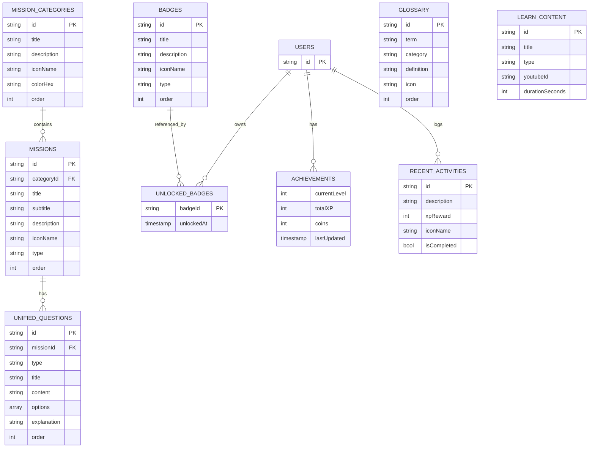

# 📚 PiensaPlay - Modelos de Datos de Firebase

Este documento describe todos los modelos de datos que se comunican y almacenan en Firebase Firestore para la aplicación PiensaPlay.

---

## 📊 Resumen de Colecciones

| Colección | Descripción | Tipo |
|-----------|-------------|------|
| `badges` | Catálogo global de insignias | Global |
| `mission_categories` | Categorías de misiones | Global |
| `missions` | Misiones individuales | Global |
| `unified_questions` | Preguntas de misiones | Global |
| `glossary` | Términos del glosario | Global |
| `learn_content` | Videos y podcasts educativos | Global |
| `users/{userId}/achievements` | Logros del usuario | Por Usuario |
| `users/{userId}/unlockedBadges` | Insignias desbloqueadas | Por Usuario |
| `users/{userId}/recent_activities` | Actividades recientes | Por Usuario |

---

## 🏆 Colecciones Globales

### 1. `badges` - Catálogo de Insignias

Catálogo global de todas las insignias disponibles en la aplicación.

**Ruta:** `badges/{badgeId}`

```dart
class Badge {
  final String id;
  final String title;
  final String? description;
  final String iconName;
  final bool isUnlocked;  // Calculado al combinar con unlockedBadges del usuario
}
```

**Estructura en Firestore:**
```json
{
  "title": "Cazador de\nFake News",
  "description": "Completaste la misión Cazadores de Fake News",
  "iconName": "search",
  "order": 1,
  "type": "mission",  // "mission" | "category"
  "createdAt": Timestamp
}
```

**Tipos de Badge:**
- `mission` - Se desbloquea al completar una misión específica
- `category` - Se desbloquea al completar todas las misiones de una categoría

---

### 2. `mission_categories` - Categorías de Misiones

Agrupa las misiones por temática educativa.

**Ruta:** `mission_categories/{categoryId}`

```dart
class MissionCategory {
  final String id;
  final String title;
  final String description;
  final String iconName;
  final String colorHex;
  final List<Mission> missions;
  bool isExpanded;
}
```

**Estructura en Firestore:**
```json
{
  "title": "Veracidadville",
  "description": "Detecta la desinformación y defiende la verdad.",
  "iconName": "shield",
  "colorHex": "0xFF6EC6FF",
  "order": 1
}
```

**Categorías disponibles:**
| ID | Título | Color |
|----|--------|-------|
| `veracidadville` | Veracidadville | Azul `#6EC6FF` |
| `zona_cero_odio` | Zona Cero Odio | Verde `#A4D65E` |
| `fortaleza_privacidad` | Fortaleza Privacidad | Amarillo `#F4D03F` |
| `ciberseguridad` | Misión Ciberseguridad | Rojo `#FF6B6B` |

---

### 3. `missions` - Misiones

Misiones individuales dentro de cada categoría.

**Ruta:** `missions/{missionId}`

```dart
enum MissionType {
  quiz,           // Selección múltiple
  trueFalse,      // Verdadero/Falso
  wordSelection,  // Selección de palabras
  stereotype,     // Rompe estereotipos
}

class Mission {
  final String id;
  final String title;
  final String subtitle;
  final String description;
  final bool isCompleted;
  final String iconName;
  final MissionType type;
  final List<QuizQuestion>? questions;
}
```

**Estructura en Firestore:**
```json
{
  "categoryId": "veracidadville",
  "title": "Cazadores de Fake News",
  "subtitle": "Veracidadville",
  "description": "Aprende a identificar noticias engañosas",
  "iconName": "check",
  "type": "quiz",
  "order": 1
}
```

---

### 4. `unified_questions` - Preguntas de Misiones

Formato de preguntas que soporta todos los tipos de misión con feedback por opción.

**Ruta:** `unified_questions/{questionId}`

```dart
enum QuestionType {
  quiz,           // Selección múltiple
  trueFalse,      // Verdadero/Falso
  wordSelection,  // Selección de palabras
  stereotype,     // Rompe estereotipos
}

class AnswerOption {
  final String id;
  final String text;
  final bool isCorrect;
  final String? imageUrl;
  final String? feedback;  // Retroalimentación específica de esta opción
}

class UnifiedQuestion {
  final String id;
  final QuestionType type;
  final String title;           // Pregunta principal
  final String? subtitle;       // Instrucción adicional
  final String? content;        // Contenido (ej: texto de noticia falsa)
  final String? imageUrl;
  final List<AnswerOption> options;
  final String explanation;           // Explicación correcta
  final String? incorrectExplanation; // Explicación incorrecta
  // Campos específicos por tipo:
  final bool? correctBoolAnswer;      // Para trueFalse
  final List<String>? correctWords;   // Para wordSelection
  final String? source;               // Fuente de noticia
  final String? date;                 // Fecha de publicación
}
```

**Estructura en Firestore:**
```json
{
  "id": "q1_zanahoria",
  "missionId": "fake_news",
  "type": "quiz",
  "title": "¿Cuáles son las señales de que esta noticia es falsa?",
  "subtitle": "Selecciona todos los elementos sospechosos",
  "content": "Científicos descubren que beber jugo de zanahoria...",
  "imageUrl": null,
  "source": "ElNoticiero.com",
  "date": "Publicado: Hoy",
  "options": [
    {
      "id": "author",
      "text": "Autor no es un experto real",
      "isCorrect": true,
      "feedback": "El 'Dr. Inventado' no es un experto verificable"
    },
    {
      "id": "source",
      "text": "Fuente no confiable",
      "isCorrect": true,
      "feedback": "ElNoticiero.com no es una fuente verificada"
    }
  ],
  "explanation": "¡Excelente! Identificaste correctamente las señales...",
  "incorrectExplanation": "Esta noticia es falsa porque...",
  "order": 1,
  "createdAt": Timestamp,
  "updatedAt": Timestamp
}
```

---

### 5. `glossary` - Glosario

Términos educativos con definiciones.

**Ruta:** `glossary/{termId}`

```dart
class GlossaryTerm {
  final String id;
  final String term;
  final String category;
  final String definition;
  final String icon;
  final int order;
  final String question;
}
```

**Estructura en Firestore:**
```json
{
  "term": "Fake News",
  "category": "Desinformación",
  "definition": "Noticias falsas creadas para engañar...",
  "icon": "📰",
  "order": 1,
  "question": "¿Qué son las Fake News?"
}
```

---

### 6. `learn_content` - Contenido Educativo

Videos y podcasts para la sección de aprendizaje.

**Ruta:** `learn_content/{contentId}`

```json
{
  "title": "Alfabetización Mediática",
  "description": "Aprende sobre los medios de comunicación...",
  "type": "video",
  "category": "Videos",
  "thumbnailUrl": "",
  "youtubeId": "ul7siGvqmB8",
  "audioUrl": null,
  "durationSeconds": 60,
  "order": 1
}
```

---

## 👤 Colecciones por Usuario

### 7. `users/{userId}/achievements` - Logros del Usuario

Almacena el progreso de gamificación del usuario.

**Ruta:** `users/{userId}/achievements/current`

```dart
class Achievement {
  final int currentLevel;
  final int totalXP;
  final int coins;
}

class GamificationConfig {
  static const int xpPerMission = 100;
  static const int xpPerCategory = 250;
  static const int coinsPerMission = 50;
  static const int xpToLevelUp = 300;
}
```

**Estructura en Firestore:**
```json
{
  "currentLevel": 3,
  "totalXP": 950,
  "coins": 350,
  "lastUpdated": Timestamp
}
```

---

### 8. `users/{userId}/unlockedBadges` - Insignias Desbloqueadas

Registro de insignias que el usuario ha desbloqueado.

**Ruta:** `users/{userId}/unlockedBadges/{badgeId}`

```json
{
  "unlockedAt": Timestamp
}
```

> **Nota:** Solo se almacena el ID del badge y la fecha de desbloqueo. Los detalles del badge se obtienen de la colección global `badges`.

---

### 9. `users/{userId}/recent_activities` - Actividades Recientes

Historial de actividades recientes del usuario.

**Ruta:** `users/{userId}/recent_activities/{activityId}`

```dart
class RecentActivity {
  final String id;
  final String description;
  final int xpReward;
  final String iconName;
  final bool isCompleted;
}
```

**Estructura en Firestore:**
```json
{
  "description": "Completaste Cazadores de Fake News",
  "xpReward": 100,
  "iconName": "check",
  "isCompleted": true,
  "lastUpdated": Timestamp
}
```

---

## 📱 Modelos Adicionales (Solo Cliente)

Estos modelos se usan en la aplicación pero **no se almacenan directamente en Firebase**:

### UserProfile

Perfil del usuario (almacenamiento local via SharedPreferences o Firebase Auth).

```dart
class UserProfile {
  final String name;
  final int age;
  final String avatarId;
}
```

### DashboardStats

Estadísticas calculadas para el dashboard.

```dart
class DashboardStats {
  final int newGames;
  final int pendingGlossary;
  final int achievements;
  final int activeMissions;
}
```

### UserProgress

Progreso general del usuario.

```dart
class UserProgress {
  final double generalProgress;
  final Map<String, double> monthlyProgress;
}
```

### MissionConfig / MapCategoryConfig

Configuración de UI para el mapa de misiones (solo cliente).

```dart
class MissionConfig {
  final String id;
  final String title;
  final String description;
  final Offset position;
  final Widget Function(BuildContext) pageBuilder;
  final bool isCompleted;
  final bool isLocked;
}

class MapCategoryConfig {
  final String categoryId;
  final String categoryTitle;
  final Color categoryColor;
  final Color bannerColor;
  final Color nodeColor;
  final String backgroundImage;
  final bool useSequentialUnlock;
}
```

---

## 🔗 Diagrama de Relaciones



---

## 🗂️ Archivos Fuente Relacionados

### Entidades (Domain Layer)
- [achievement.dart](file:///c:/Users/Alex/Desktop/flutter/piensa-play/piensa_play/lib/features/achievements/domain/entities/achievement.dart)
- [badge.dart](file:///c:/Users/Alex/Desktop/flutter/piensa-play/piensa_play/lib/features/achievements/domain/entities/badge.dart)
- [recent_activity.dart](file:///c:/Users/Alex/Desktop/flutter/piensa-play/piensa_play/lib/features/achievements/domain/entities/recent_activity.dart)
- [glossary_term.dart](file:///c:/Users/Alex/Desktop/flutter/piensa-play/piensa_play/lib/features/glossary/domain/entities/glossary_term.dart)
- [mission.dart](file:///c:/Users/Alex/Desktop/flutter/piensa-play/piensa_play/lib/features/missions/domain/entities/mission.dart)
- [mission_category.dart](file:///c:/Users/Alex/Desktop/flutter/piensa-play/piensa_play/lib/features/missions/domain/entities/mission_category.dart)
- [unified_question.dart](file:///c:/Users/Alex/Desktop/flutter/piensa-play/piensa_play/lib/features/missions/domain/entities/unified_question.dart)
- [user_profile.dart](file:///c:/Users/Alex/Desktop/flutter/piensa-play/piensa_play/lib/features/onboarding/domain/entities/user_profile.dart)
- [user_progress.dart](file:///c:/Users/Alex/Desktop/flutter/piensa-play/piensa_play/lib/features/home/domain/entities/user_progress.dart)
- [dashboard_stats.dart](file:///c:/Users/Alex/Desktop/flutter/piensa-play/piensa_play/lib/features/home/domain/entities/dashboard_stats.dart)

### Servicios y Datasources
- [unified_questions_service.dart](file:///c:/Users/Alex/Desktop/flutter/piensa-play/piensa_play/lib/core/services/unified_questions_service.dart)
- [achievements_remote_datasource.dart](file:///c:/Users/Alex/Desktop/flutter/piensa-play/piensa_play/lib/features/achievements/data/datasources/achievements_remote_datasource.dart)
- [glossary_remote_datasource.dart](file:///c:/Users/Alex/Desktop/flutter/piensa-play/piensa_play/lib/features/glossary/data/datasources/glossary_remote_datasource.dart)

### Scripts de Seed
- [seed-firebase.js](file:///c:/Users/Alex/Desktop/flutter/piensa-play/scripts/seed-firebase.js)
- [seed-badges.js](file:///c:/Users/Alex/Desktop/flutter/piensa-play/scripts/seed-badges.js)
- [seed-unified-questions.js](file:///c:/Users/Alex/Desktop/flutter/piensa-play/scripts/seed-unified-questions.js)

---

## 📝 Notas Adicionales

1. **Almacenamiento Local**: El progreso de misiones (`MissionProgressService`) usa SharedPreferences, no Firebase.

2. **Badges**: 
   - La colección `badges` es el catálogo global
   - `users/{userId}/unlockedBadges` solo almacena los IDs desbloqueados
   - El estado `isUnlocked` se calcula al combinar ambas fuentes

3. **IDs de Usuario**: Se obtienen via `UserIdProvider.currentUserId`
